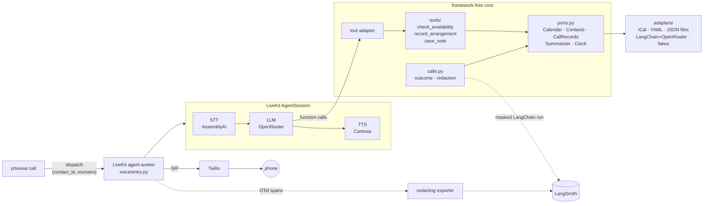

# phoneai

[](https://github.com/sattaman/phoneai/actions/workflows/ci.yml)

An agentic voice assistant that **places real phone calls on your behalf**. It rings a
contact, holds a natural, real-time British-English conversation, uses tools mid-call to
check your calendar and record what was agreed, takes messages, and writes up every call.

Built with [LiveKit Agents](https://docs.livekit.io/agents/) (real-time voice and SIP
calling), OpenRouter (swappable LLMs), LangChain (structured summaries) and LangSmith
(tracing and evals), around a small ports-and-adapters core that is tested offline.

### Highlights

- **Real-time constraints.** A phone turn has about a second of budget. Voices, models and
  turn-taking were chosen from measured latency on real calls
  ([voice experiments](docs/voice-experiments.md)).
- **Tools the model can't fake.** Outcomes come from tool state, not from what the model
  says. Two failures seen on real calls became regression tests.
- **Evals, not vibes.** Scripted conversations × models, scored by deterministic checks and
  LLM judges, one LangSmith experiment per model ([results](docs/evals.md)).
- **Traceable and private.** Each call is a LangSmith thread, with phone numbers redacted
  before any span leaves the process.
- **Swappable pipelines.** Cascade (speech-to-text → LLM → TTS) or speech-to-speech (Gemini
  Live) per voice profile, with the same tools and scenarios.

**[▶ Demo: a real 60-second call](docs/demo.mp4)**: the agent books a gym session, sticks
to the owner's available hours (a 9pm start is pushed to 8pm by the booking tool), confirms
the date and takes the place name correctly.

From another test call (the callee tries to divert it):

> **Agent:** Hello, I'm Tom's AI assistant. He's keen to get a gym session in with you, so
> I'm calling to see when and where suits you best.
> **Callee:** How about while you're in the gym, I can come and help do some gardening?
> **Agent:** My green thumb isn't quite developed enough for gardening yet, so let's get
> that gym session in the diary instead.

```text
$ phoneai call friend --scenario book_gym_session
Call 3f9c21aa dispatched to friend (book_gym_session).

$ phoneai calls
2026-10-04 13:05  3f9c21aa  friend     book_gym_session     provisional  Sun 11 Oct 15:00 @ PureGym Leeds
```

## What it does

1. `phoneai call <contact>` asks a running agent worker to phone a contact, following a
   **scenario** (a YAML brief, for example "arrange a gym session: day, time and place").
2. The agent dials through a Twilio SIP trunk, says up front that it's an AI calling on your
   behalf, and holds the conversation: speech-to-text (AssemblyAI Universal-3.6, en-GB), an LLM via
   OpenRouter (`gpt-4.1-mini` by default), and text-to-speech (Cartesia Sonic-3.6, British
   voice, with expressive mode for emotion and pauses). It plays along with jokes, deflects
   off-topic requests and steers back to the goal.
3. It uses **tools**: `check_availability` (your calendar, via iCal), `record_arrangement`
   (checks the calendar itself and records the result as *agreed* or *provisional*),
   `save_note` (messages for you) and `end_call`.
4. When the call ends it writes `calls/<id>.json` and `.md`: outcome, arrangement, notes,
   an LLM summary, the transcript (phone numbers redacted), and latency and token metrics.

## Architecture



Key decisions are written up as ADRs:

- [Ports and adapters, kept minimal](docs/adr/0001-ports-and-adapters.md)
- [Tools first; outcomes come from tool state, not model claims](docs/adr/0002-tools-first-outcomes-from-state.md)
- [LiveKit runs the conversation; no LangGraph (yet)](docs/adr/0003-livekit-loop-not-langgraph.md)
- [Privacy by design](docs/adr/0004-privacy-by-design.md)

## Testing and evals

| Layer | Command | Cost | What it covers |
|---|---|---|---|
| Unit | `make test` | free, offline, ~2s | slot maths, tools against fakes, iCal edge cases, outcomes, redaction, the call setup and failure paths, the trace exporter |
| Agent behaviour | `make test-llm` | ~1p | real model, real tools, fake calendar; regression tests for behaviour seen on real calls |
| Model comparison | `phoneai eval --models a,b,c` | pennies | scripted conversations × models, deterministic checks + LLM judges, one LangSmith experiment per model |

Results: **[docs/evals.md](docs/evals.md)**.

Two bugs found on real calls drove the design:
- The model claimed "Tom is busy on Sundays" with no calendar connected. Now
  `record_arrangement` decides agreed vs provisional, and a test checks the agent never
  claims busy or free.
- The model never asked which gym. Now vague places ("the gym") are rejected by the tool,
  and a test checks it asks.

## Observability

With `LANGSMITH_TRACING=true`, each call is a single **LangSmith thread**, via the official `langsmith[livekit]`
integration (`configure_livekit()` plus `set_thread_id(call_id)`):

- the session trace, with STT, LLM and TTS spans, tool calls, token usage and latency
- the post-call `call_summary` LangChain run
- tags for scenario, profile, models and contact id on every span

Before anything leaves the process, LiveKit spans pass through a **redacting OpenTelemetry
exporter**, and the LangChain run uses a client with a redacting anonymizer. Both were
verified against LangSmith by speaking a phone number on a call. Call records also store
p50/p95 latency (end-to-end, LLM time to first token, TTS time to first byte,
end-of-turn) and token counts.

## Privacy

Stored phone numbers live only in a gitignored `contacts.local.yaml`. Dispatch metadata,
SIP identities, logs, records and traces use ids. Numbers spoken during a call do pass
through the speech and LLM providers in real time, but they're redacted from records,
summaries and traces. Audio recording is off unless you're calling yourself. gitleaks runs in
pre-commit and CI. Committed scenarios, contacts and eval cases are synthetic. See
[ADR 4](docs/adr/0004-privacy-by-design.md).

## Quick start

Prerequisites: Python 3.13, [uv](https://docs.astral.sh/uv/), a
[LiveKit Cloud](https://cloud.livekit.io) project (the free tier includes speech inference
credit), an [OpenRouter](https://openrouter.ai) key, and, for real calls, a Twilio Elastic
SIP trunk with a credential list and a number.

```sh
make install                                  # uv sync + pre-commit hooks
cp .env.example .env                          # fill in keys
cp contacts.example.yaml contacts.local.yaml  # who the agent may call
make test                                     # offline tests

uv run phoneai agent dev                      # terminal 1: agent worker
uv run phoneai call me --scenario book_gym_session   # terminal 2: rings you
uv run phoneai calls                          # outcomes
```

**No phone needed to try it.** You can talk to the agent with your own mic and speakers:

```sh
uv run phoneai agent console                                    # in your terminal
uv run phoneai agent console --scenario book_gym_session --profile uk_luna
```

Or run `phoneai agent dev` and open your project's **Agents → Console** in LiveKit Cloud
(agent name `phoneai`) to talk to it in the browser. Either way the session is written up
in `calls/` like a phone call.

Configuration lives in three places:
- `.env`: keys, plus `OWNER_NAME`, `TIMEZONE`, `MAX_CALL_SECONDS` and
  `GOOGLE_CALENDAR_ICAL_URL`
- `profiles.yaml`: voice pipelines.
  - `uk_default`: the cascade described above
  - `uk_luna`: GPT-6 Luna, cheaper and slightly slower
  - `uk_deepgram`: the original Deepgram voice
  - `uk_gemini_live` and `uk_gemini_flash_live`: speech-to-speech
- `scenarios/examples/*.yaml`: call briefs, with allowed tools and success criteria.
  Personal scenarios go in the gitignored `scenarios/private/`.

## Layout

```text
src/phoneai/
  domain.py          core types and pure rules: free slots, outcomes, redaction, instructions
  ports.py           Calendar · Contacts · CallRecords · Summariser · Clock
  tools/             agent tools (plain async functions)
  calls.py           connect the callee, finish a call (outcome, redaction, summary, save)
  adapters/          iCal, YAML contacts, JSON records, LangChain/OpenRouter summariser,
                     LiveKit SIP + dispatch, in-memory fakes
  voice/             LiveKit agent, session factory, tool adapter, worker entrypoint
  observability.py   LangSmith setup, redacting exporter, per-call metadata
  evals.py           eval cases, checks, report
  cli.py             phoneai agent | call | calls | eval
tests/{unit,agent,evals}   evals/cases.yaml   docs/{adr,evals.md}
```

## Known limits

- **Booking is provisional or checked-free, not written.** The agent never creates calendar
  events. `create_appointment` (Google Calendar API) is on the backlog.
- **Calendar access is a read-only iCal feed.** Without it, every arrangement is
  provisional.
- **Calls end at a hard deadline** (`MAX_CALL_SECONDS` or `--max-seconds`, measured from when the agent starts the call; requests older than 60s are dropped rather than dialled), with a
  spoken goodbye. Failures are recorded with a fixed category (for example `sip_486` or
  `unknown_contact`) and no personal detail.
- **Caller ID is a US Twilio number** until a UK number's regulatory approval completes.
  Twilio trial accounts can only call verified numbers, and play a trial message first.
- **Redaction targets phone numbers.** Names and conversation content still reach
  LangSmith.
- **Agent and eval tests use real models,** so their results vary between runs; the evals
  report pass rates over several samples.

## Responsible use

The agent always says up front that it's an AI calling on someone's behalf. It only calls
numbers you've put in your local contacts file, and calls are capped in length. Use it for
people who'd be happy to get the call.

## Licence

MIT
